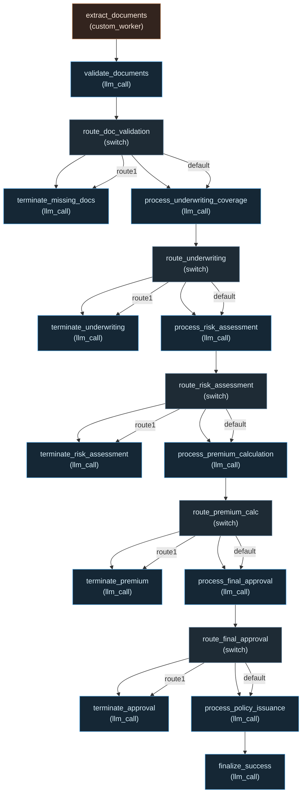

# SimpleAgentsHealthInsurance

Health insurance underwriting workflow built with [Simple Agents](https://github.com/CraftsMan-Labs/SimpleAgents) (`simple-agents-py`). The pipeline is defined in `workflow.yaml`; `main.py` runs it from the CLI with streaming output, and `app.py` provides a Streamlit UI.

## Requirements

- **Python 3.12+**
- **[uv](https://docs.astral.sh/uv/)** — install dependencies and run commands
- **Docker** (optional) — only if you want local [Langfuse](https://langfuse.com/) for OpenTelemetry tracing

## Setup

1. **Environment variables**

   ```bash
   cp .example.env .env
   ```

   Edit `.env` and set at least:

   - `WORKFLOW_API_KEY` — your LLM API key  
   - `WORKFLOW_API_BASE` — provider base URL (e.g. `https://api.openai.com/v1` or your gateway)  
   - `WORKFLOW_PROVIDER` — e.g. `openai`

   Langfuse keys are optional; leave the placeholder values if you are not using local tracing.

2. **Install dependencies** (from the repo root):

   ```bash
   uv sync
   ```

## Run the workflow (CLI)

Run from the **repository root** so `workflow.yaml` resolves correctly:

```bash
uv run main.py
```

Output streams to the terminal. With real Langfuse keys and a running Langfuse stack, traces are sent via OpenTelemetry (see below).

## Run the Streamlit app

```bash
uv run streamlit run app.py
```

Open the URL Streamlit prints (by default **http://localhost:8501**). To use another port:

```bash
uv run streamlit run app.py --server.port 8502
```

## Optional: Langfuse (Docker) for tracing

The repo includes a **Langfuse v3** stack (Postgres, ClickHouse, Redis, MinIO) for local OTEL ingestion.

1. **Create the Postgres volume once** (required by `docker-compose.yml`):

   ```bash
   docker volume create simpleagentshealthinsurance_langfuse_db_data
   ```

2. **Start services**:

   ```bash
   docker compose up -d
   ```

3. Open **http://localhost:3000**, create an account/project, and copy **public** and **secret** keys into `.env` as `LANGFUSE_PUBLIC_KEY` and `LANGFUSE_SECRET_KEY`.

4. Run `uv run main.py` or the Streamlit app again; traces should show up in Langfuse.

MinIO is exposed for debugging at **http://localhost:9010** (API) and **http://localhost:9011** (console), with credentials `minio` / `miniosecret` as defined in `docker-compose.yml`.

---

## Workflow diagram


